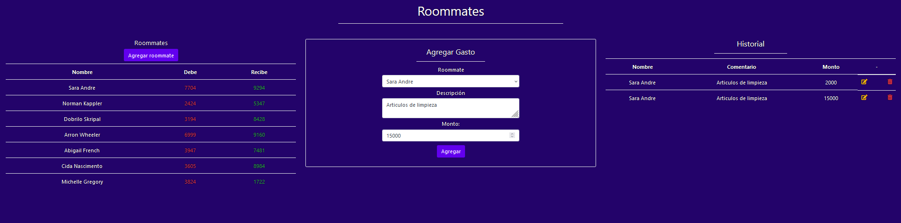

git clone https://github.com/siseveca79/Roommates-SSVC

cd Roommates-SSVC

npm install axios@1.7.2 body-parser@1.20.2 cors@2.8.5 dotenv@16.4.5 express@4.19.2 googleapis@139.0.0 node-fetch@2.7.0 nodemailer@6.9.13 uuid@9.0.1

npm install

node --watch app.js

Control + presionar la url.

El servidor se está ejecutando en http://localhost:3000

